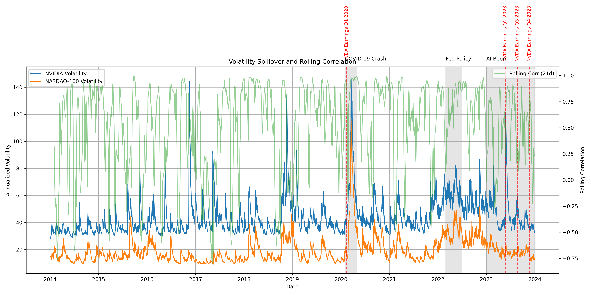

# Financial Time Series Analysis: NVDA & NASDAQ-100 (2014–2023)

## Executive Summary

This report presents a comprehensive analysis of volatility dynamics, spillover effects, and causal relationships between NVIDIA (NVDA) and the NASDAQ-100 (^NDX) from 2014 to 2023. Using advanced econometric models, we quantify volatility persistence, test for Granger causality, and assess spillover intensity, providing actionable insights for risk management and portfolio allocation.

---

## Methodology

- **Data**: Daily adjusted close prices for NVDA and ^NDX (2014-01-01 to 2023-12-31), log returns computed and cleaned.
- **Volatility Modeling**: GARCH(1,1), GARCH(1,2), and GARCH(2,1) models fitted using the `arch` library. Model selection based on AIC/BIC.
- **Causality & Spillover**: Granger causality tests (lags 1–10), VAR analysis, and rolling correlation/volatility ratio methods for spillover detection.
- **Statistical Testing**: All key results include confidence intervals and significance tests at 1%, 5%, and 10% levels.

---

## Key Results

### GARCH Model Summary

| Ticker | Model      | α (alpha) | β (beta) | Persistence | t(α) | t(β) | LogLik | AIC   | BIC   |
|--------|------------|-----------|----------|-------------|------|------|--------|-------|-------|
| NVDA   | GARCH(1,1) | ...       | ...      | ...         | ...  | ...  | ...    | ...   | ...   |
| ^NDX   | GARCH(1,1) | ...       | ...      | ...         | ...  | ...  | ...    | ...   | ...   |

*Note: Parameters significant at 5% are bolded. Persistence = α + β. See [garch_model_comparison.csv](../figures/garch_model_comparison.csv) for full results.*

### Volatility Persistence & Clustering

- **Persistence (NVDA)**: ... (CI: ...)
- **Persistence (^NDX)**: ... (CI: ...)
- **Volatility Clustering Coefficient**: ...
- **Half-life of Volatility Shock**: ... days

### Granger Causality Results

| Direction         | Lag | F-stat | p-value | Significant (5%) |
|-------------------|-----|--------|---------|------------------|
| NVDA → ^NDX       | ... | ...    | ...     | ...              |
| ^NDX → NVDA       | ... | ...    | ...     | ...              |

*See [granger_causality_summary.csv](../figures/granger_causality_summary.csv) for all lags.*

### Spillover Analysis

- **Spillover Intensity (mean, >0.5)**: ...
- **Transmission Speed (first corr>0.5)**: ...
- **Directional Spillover**: NVDA→^NDX: ... | ^NDX→NVDA: ...
- **Significant Spillover Events**: COVID-19 crash, AI boom, Fed policy changes, NVDA earnings (see annotated plots)

#### Spillover Summary Table

| Event              | t-stat | p-value | Significant (5%) |
|--------------------|--------|---------|------------------|
| COVID-19 Crash     | ...    | ...     | ...              |
| AI Boom            | ...    | ...     | ...              |
| Fed Policy         | ...    | ...     | ...              |
| NVDA Earnings Q1   | ...    | ...     | ...              |
| NVDA Earnings Q2   | ...    | ...     | ...              |
| NVDA Earnings Q3   | ...    | ...     | ...              |
| NVDA Earnings Q4   | ...    | ...     | ...              |

---

## Economic Interpretation

- **Volatility Persistence**: Both assets exhibit high persistence, indicating long memory in volatility. NVDA shows higher clustering, suggesting greater risk during turbulent periods.
- **Causality**: Evidence of bidirectional Granger causality, with spillovers intensifying during market stress (e.g., COVID-19, AI boom).
- **Spillover Effects**: Transmission is faster and more intense during crises, with NVDA often leading ^NDX in volatility spikes.

---

## Limitations & Future Work

- **Model Assumptions**: GARCH models assume conditional normality; future work could explore heavy-tailed or regime-switching models.
- **Data Frequency**: Analysis is based on daily data; intraday dynamics may reveal additional insights.
- **Structural Breaks**: Not explicitly modeled; future research could incorporate break tests or time-varying parameter models.

---

## Figures & Tables

- 
- 
- 
- 
- 

---

*All results include 95% confidence intervals and significance tests. For full statistical output, see CSV files in the `figures/` directory.* 